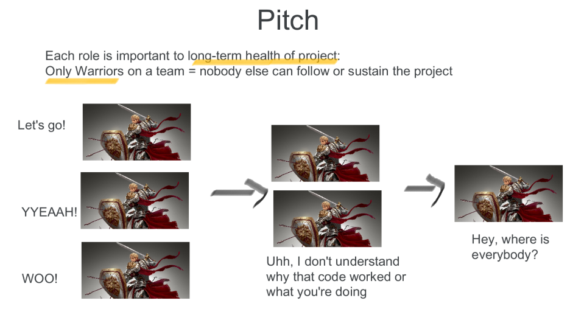
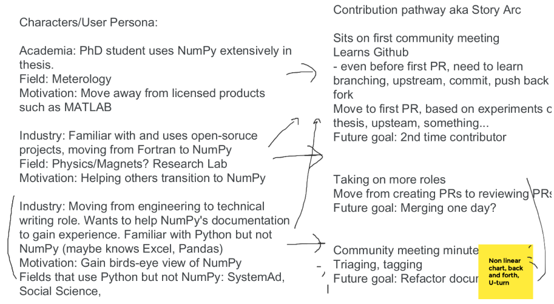
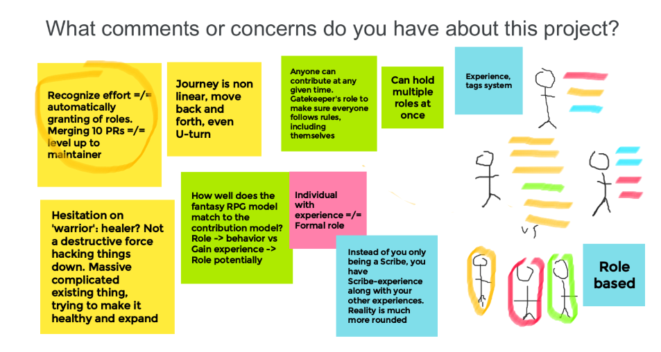
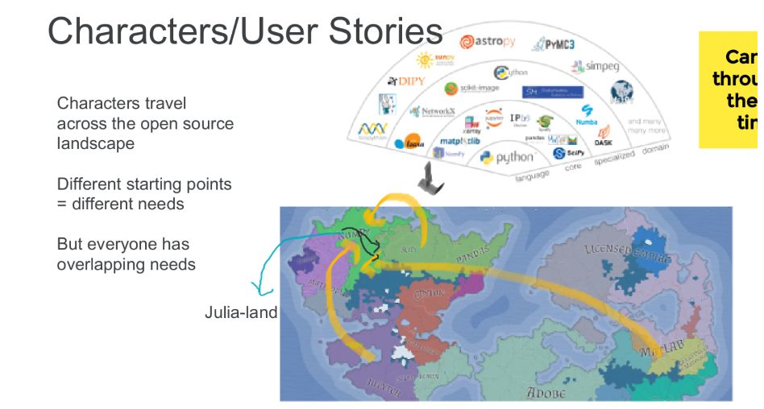
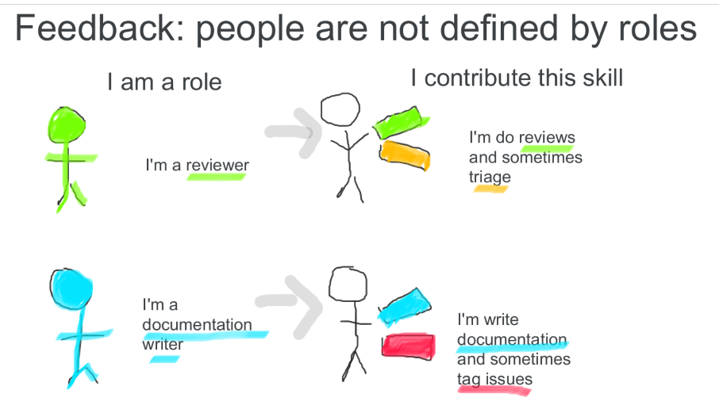
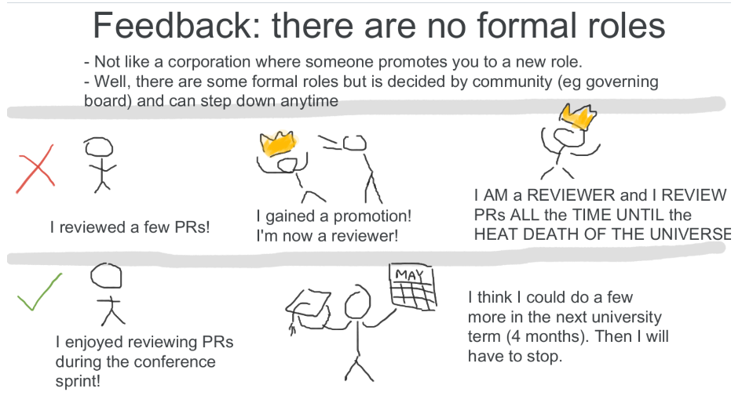

# Summary from Brainstorming Sessions

*Slide from Google Jamboard explaining how the fantasy roles correlate to contributor roles*

## Key points
- From NumPy Newcomers Hour
  - **Migrating users**
    - Different ways people come to NumPy- from other languages such as Julia or R. Or from other open-source Python. Or from properity software.
  - **Non-linear** pathways
    - People can take on multiple roles or change roles over time

*Screenshot of user pathway exploration*

- From NumPy Documentation Meeting
  - **Incomplete metaphor**: How well does the fantasy RPG model **match the contribution model**?
    - Perhaps move away from role-based model eg You are a warrior = You are a code contributor.
    - People don't first become a role and then do the role's job. People just do it, and maybe community/external recognition received
    - Move to experience-based system?
    - Comparison to relational vs non-relational databases. In non-relational, a person can have multiple 'tags' rather than put in a single folder
  - Inherent difficulty in **quantifying what cannot be easily quantified**
    - In RPGS, players distinctly 'level up'.
    - In corporate job, people are promoted to a new title and responsibilty.
    - In open source, there is very little quantified or formally given (exception: community appointed roles such as being on a steering counceil). Generally self-appointed.

*Screenshot of Google Jamboard about above mentioned discussion*

- From NumPy Community Meeting
    - **Extending the metaphor**: Sprints, Issues and PRs as Quests
    - Move from Role-based to **Skill-based**
      - Similar to 'skill builds' in Diablo 3
      - Percentage model? Someone is a  Warrior vs someone has 30% documentation, 40% triaging, 30% code contributions build.
    - **Emotional core**
      - Why do people come back again? Sense of community, whether a fantasy party or contribution
    - Exploring **user pathways** -> fantasy archtypes
      - The Boredom Buster: I don't want to write my thesis and this looker cooler
      - The Bug Killer: Squash. Them. All
      - The Lone Wolf: I will fix this in my fork and not share it upstream
    - **Representation**
      - How a community and its practices wants to be represented to other groups
  

*Screenshot of Google Jamboard about user pathways and open-source landscape as a physical world and fantasy map to explore*

*Screenshot of Google Jamboard about how people are not defined by their roles*

*Screenshot of Google Jamboard about how open-source generally does not have formally appointed roles* 

## NumPy Newcomers Hour, May 4 2023
Snippet from the 2023-05-04 NumPy Newcomers’ Hour meeting notes. For the full meeting notes, check https://github.com/numpy/archive/tree/main/newcomers_meetings

Present (add your name and GitHub handle): JulesKouatchou (@JulesKouatchou), Mars Lee (@marsbarlee)

- Mars: Hosting brainstorming session for GSOD project at next Newcomers Hour (May 18th, 2023)?
    - Similar to sessions to be held on May 8 and May 10
    - [Link to Google Jamboard](https://jamboard.google.com/d/1j_rEIslOh59N9cLGU1VGc7rTc88SuLTi7l4YqTqAULc/edit?usp=sharing)
    - Feedback on User Profiles
        - "Migrating users", moving from Fortran or Julia or R to Python
        - When someone would use Fortran vs NumPy, especially for heavy computation
        - When someone would use Julia, especially useful in specific financial uses
        - Non-linear paths contributors can take
        - Learning to contribute to NumPy has it's own specifications different from other projects eg NumPy naming conventions

## NumPy Documentation Meeting, May 8 2023
Snippet from the 2023-05-08 NumPy Documentation meeting notes. For the full meeting notes, check https://github.com/numpy/archive/blob/main/docs_team_meetings/docs-2023-05-08.md

**Present:** Mukulika, Ross, Jules, Mridul, Mars, Inessa

- Gathering community input for GSOD-NumPy 2023 with a 10 minute Brainstorming Session
    - [Link to Google Jamboard](https://jamboard.google.com/d/1j_rEIslOh59N9cLGU1VGc7rTc88SuLTi7l4YqTqAULc/edit?usp=sharing)
    - Main questions
        - What comments or concerns do you have about this project?
        - Based on your role in NumPy, what would your fantasy class be?
    - Can leave your comments on Jamboard after meeting as well
    - Discussion points
        - Incomplete metaphor: How well does the fantasy RPG model match the contribution model?
        - In fantasy RPG, role -> experience. In contribution, gain experience -> maybe gain role
        - Move to Role-based -> Experience based. Use badges or tags instead of RPG class?
        - Inherent difficulty in quantifying what cannot be easily quantified
        - Concern: Quantifying without nuance might turn contribution into a competition
        - Hesitation to call code contributor warriors. Maybe fits in RPG context but not in building software?
        - Is there another metaphor that could work? eg building houses? camping?
        - Dungeons and Dragons (DnD) was given as a metaphor. But DnD is very western-centric, may be unfamiliar to some audiences

## NumPy Community Meeting, May 10 2023
Snippet from the 2023-05-10 NumPy Newcomers’ Hour meeting notes. For the full meeting notes, check https://github.com/numpy/archive/blob/main/community_meetings/community-2023-05-10.md

- Gathering community input for GSOD-NumPy 2023 with a 10 minute Brainstorming Session
    - [Link to Google Jamboard](https://jamboard.google.com/d/1j_rEIslOh59N9cLGU1VGc7rTc88SuLTi7l4YqTqAULc/edit?usp=sharing)
    - Main questions
        - What comments or concerns do you have about this project?
        - Based on your role in NumPy, what would your fantasy class be?
    - Can leave your comments on Jamboard after meeting as well
    - Discussion points
        - Fluidity of role
            - Instead of fixed roles, people can have percentage of skills or a skill build like Diablo 2
        - Guided vs unguided
            - guided: existing issues
            - unguided: nobody understand entire project, go with what your interested with
        - DnD might be western-centric but Fantasy concepts and classes are widely known
        - Quests
            - People complete quests together
            - Sprints as mini quests? Focused on smaller quests or "good first issues". So training for "main quest"
            - Issues and PRs as quests? We are NPCs?
            - People get interested in side-quests ("Ooh, what's over there?") which can be just as important as the 'main quest'. 
        - The Emotional Core
            - People brought together to complete a sprint, enjoy time and want to meet up again (returning contributors)
            - People come back because of welcoming community
        - Motiviation and characters
            - In pursuit of intellect: I want to know more
            - Curosity: Oh, what's over there?
            - The Wanderer: I don't know where I'm going and that's OK
            - The Boredom Buster: I don't want to write my thesis and this looker cooler
            - The Bug Killer: Squash. Them. All
            - The Lone Wolf: I will fix this in my fork and not share it upstream
            - Antihero Fame Seeker: NumPy is a big, important project and I want to make my mark!
        - Maintainers/community members as providing direction
            - Human guideposts on the map
            - Make suggestions, not dictating what to do
        - Responsibilty and weight of a big project
            - Downstream projects
        - Representation
            - How a community wants to be represented to other groups